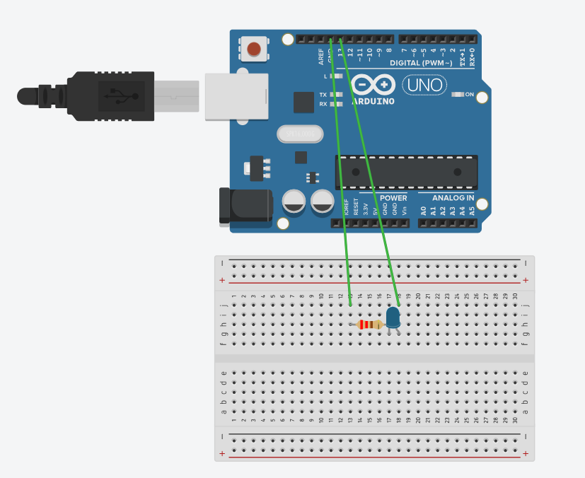

## Blink (slow and fast) — Example 1

This folder contains a minimal Arduino example that blinks an LED at two speeds and the accompanying schematic and notes.

### Contents

- `1.blink_slow_and_fast.ino` — The Arduino sketch. Upload this to a compatible board (e.g., Arduino Uno). The sketch toggles an LED between a slow and a fast blink pattern.
- `1.blink_slow_and_fast..txt` — A plain-text companion note (added by the author) that explains the experiment and/or wiring steps.
- `schematic.png` — Simple wiring diagram showing how the LED (and resistor) is connected to the board.

### Schematic

Figure: Simple wiring diagram for connecting an external LED (anode -> digital pin, cathode -> resistor -> GND).

### What this example demonstrates

- Basic digital output using the Arduino `digitalWrite()` and `delay()` functions.
- How to change blink timing by adjusting delay values.
- Simple wiring of an LED (with series resistor) to a digital I/O pin.

### Quick start

1. Open `1.blink_slow_and_fast.ino` in the Arduino IDE.
2. Connect your Arduino (e.g., Uno) to your computer.
3. Select the correct board and serial port in the IDE.
4. Upload the sketch.
5. Observe the on-board (or external) LED blinking — it will alternate between slow and fast patterns as implemented in the sketch.

If using an external LED: connect the LED's anode to the digital pin shown in `schematic.png` (common examples use pin 13), the cathode to a 220 Ω resistor, then to GND.

### Notes and troubleshooting

- If the LED does not blink: check wiring, verify the correct board/port are selected, and ensure the sketch uploaded successfully.
- If using a board without a built-in LED on pin 13, wire an external LED as shown in `schematic.png`.
 — check it for extra guidance.

### License & Author

This example is a tiny educational sketch included in the repository `iot-basics-uci` by the project author. Reuse freely for learning and experiments.

---
Path: `arduino/1.blink_slow_and_fast`

