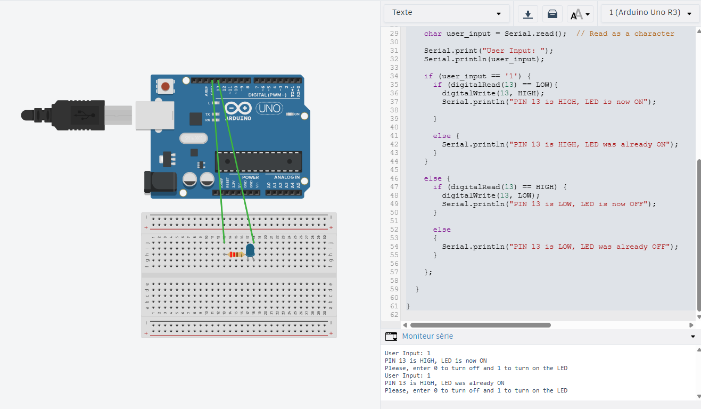

## LED Control by User (Serial) — Example

This folder demonstrates controlling an LED from the host computer via the Arduino serial connection. It includes the sketch, a wiring schematic image, and a small example thumbnail.

### Contents

- `1_led_control_by_user.ino` — The Arduino sketch (open this file in the Arduino IDE). The sketch uses digital pin 13 and a 9600 baud serial connection.
- `1_led_control_by_user.png` — Wiring schematic for the example (embedded below).
- `0_hello_world.png` — A related image (thumbnail or screenshot) included in the folder.

### Schematic



Figure: Wiring for an external LED connected to a digital output pin (series resistor to GND). The sketch uses the serial interface to receive simple commands from the host.

### Exact behavior (from the sketch)

- Hardware pin: digital pin 13 (the sketch calls `pinMode(13, OUTPUT)` and initializes the pin LOW).
- Serial baud rate: 9600 (`Serial.begin(9600)`).
- Accepted input: the sketch reads a single character from Serial and accepts:
	- `'1'` — turn the LED ON (sets pin 13 HIGH). The sketch prints informational lines when this occurs.
	- `'0'` — turn the LED OFF (sets pin 13 LOW). The sketch prints informational lines when this occurs.
- The sketch prints a single prompt once (to avoid flooding):
	- "[INFO] Please, enter 0 to turn off and 1 to turn on the LED"
- The sketch ignores newlines, carriage returns and spaces (`'\n'`, `'\r'`, `' '`). Any other character produces an error message printed over Serial.

### Quick start

1. Open `1_led_control_by_user.ino` in the Arduino IDE.
2. Connect your Arduino to your computer via USB.
3. Select the correct board and serial port in the IDE.
4. Upload the sketch to the board.
5. Open the Arduino Serial Monitor (or another serial terminal) and set the baud rate to 9600.
6. In the Serial Monitor, send the character `1` (without quotes) and press Send to switch the LED on. Send `0` to switch it off.

Example session (what you should see in the Serial Monitor):

```
[INFO] Please, enter 0 to turn off and 1 to turn on the LED
User Input: 1
[OUTPUT] PIN 13 is HIGH, LED is now ON
User Input: 0
[OUTPUT] PIN 13 is LOW, LED is now OFF
```

### Wiring notes

- If you use an external LED, place a current-limiting resistor (220 Ω typical) in series with the LED anode. Connect the LED cathode to GND.
- Many Arduino boards have a built-in LED on pin 13 — you can test the sketch without wiring an external LED by using that built-in LED.

### Troubleshooting

- Nothing happens when sending serial commands: verify you selected the correct serial port and set the Serial Monitor to 9600 baud. Confirm the sketch was uploaded successfully.
- LED doesn't light: check wiring (polarity and resistor), and confirm that the sketch's pin (13) matches your wiring.
- You see `[ERROR] Invalid input—only 0 or 1 accepted.` — make sure you send exactly the characters `0` or `1` (no extra spaces or other characters).


### License

Example code and images are part of the `iot-basics-uci` repository and provided for educational use by the author.

---
Path: `arduino/2.serial/1_led_control_by_user`


