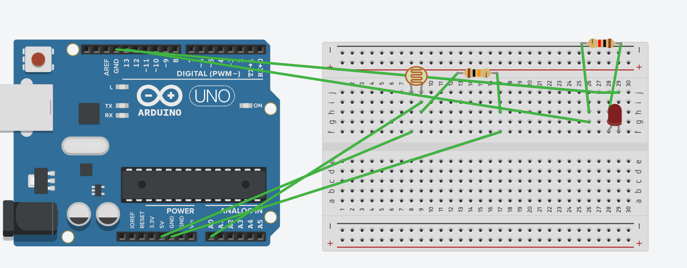
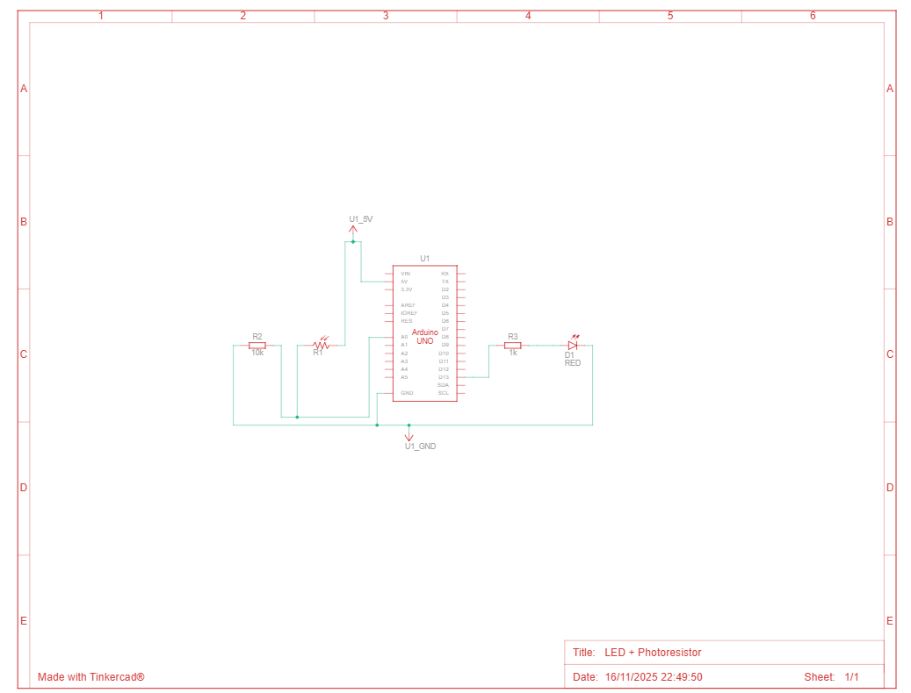

## LED in a Dark Room — Photoresistor example

This example shows how to use a photoresistor (LDR) in a voltage divider to detect ambient light and switch an LED on when the environment becomes dark.

Folder contents

- `1_led_in_dark_room.ino` — Arduino sketch. Reads an analog value from `A0` (photoresistor) and turns an LED on pin `13` on when the reading is below a threshold (500). Prints sensor readings over Serial at 9600 baud.
- `1_led_in_dark_room_schema.png` — Wiring schematic (visual diagram) for the circuit.
- `1_led_in_dark_room_schema_electric.png` — More detailed/electric-style schematic (includes resistor values and connections).

Schematics

Figure: Top — a simple wiring diagram. Bottom — a more detailed electrical schematic showing resistor values.

What the sketch does

- Initializes `pinMode(13, OUTPUT)` for the LED and `pinMode(A0, INPUT)` to read the photoresistor.
- Uses `analogRead(A0)` to obtain a sensor value (0–1023) and prints it to Serial at 9600 bps.
- If the sensor value is below `500` the sketch sets pin 13 HIGH (LED on); otherwise it sets pin 13 LOW (LED off).
- The sketch waits 1 second between readings (`delay(1000)`).

Hardware notes

- Photoresistor connection: use a voltage divider. The repository's notes and schematics use a 10 kΩ fixed resistor in series with the photoresistor (the code comments call this R1 = 10k in the divider).
- LED series resistor: use a 220 Ω resistor in series with the LED to limit current (the code comments call this R2 = 220 Ω).
- Wiring summary:
  - One end of the LDR to +5V, the other end to `A0` and to the 10 kΩ resistor which goes to GND (voltage divider).
  - LED anode to digital pin 13 (or choose another digital pin and update the sketch), LED cathode through 220 Ω resistor to GND.

Calibration and tuning

- Threshold: the sketch uses `500` as the threshold. Depending on your ambient light and component tolerances, you may want to tune this value up or down in the `if (sensorValue < 500)` test.
- Reading stability: you can average multiple `analogRead()` samples to reduce flicker or use `delay()` adjustments.

Quick start

1. Wire the photoresistor and the 10 kΩ resistor as a voltage divider connected to `A0` (see schematics).
2. Wire the LED and 220 Ω resistor to pin 13 and GND.
3. Open `1_led_in_dark_room.ino` in the Arduino IDE.
4. Select your board and serial port, then upload the sketch.
5. Open the Serial Monitor at 9600 baud to watch sensor values and verify behavior.
6. Cover the photoresistor with your hand (or place the circuit in a dark box) — the LED should turn on when the value drops below the threshold.

Troubleshooting

- LED never turns on: verify photoresistor wiring and that `A0` is actually connected to the divider. Check Serial output to see the sensor value; tweak the threshold accordingly.
- LED always on: sensor value may be low because of wiring or resistor orientation; check connections and reference the detailed schematic. Increase the threshold to require darker conditions.
- No Serial output: ensure the Serial Monitor baud is set to 9600 and the correct port is selected.

Potential improvements

- Add smoothing (moving average) to the sensor readings to reduce flicker.
- Use a configurable threshold (read from EEPROM or via Serial commands) instead of a hard-coded value.
- Add an indicator LED or status messages when changing modes.

License

This example is part of the `iot-basics-uci` collection and is provided for educational purposes by the author.

Path: `arduino/3.actuators/1_led_in_dark_room`
